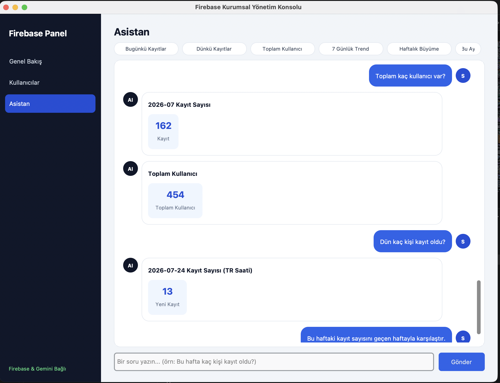
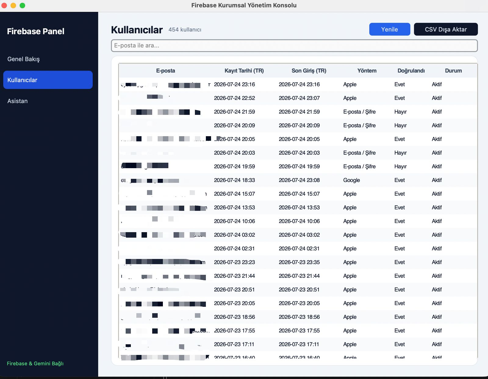

# FirebaseController

FirebaseController, Firebase veritabanınızdaki kullanıcı istatistiklerini ve verilerini doğal dil kullanarak sorgulamanızı sağlayan Python tabanlı bir masaüstü asistan uygulamasıdır. Arayüz tasarımı CustomTkinter ile geliştirilmiş olup, arka planda Google Gemini API ve Firebase Admin SDK kullanılmaktadır.

## Ekran Görüntüleri

### Sohbet ve Sorgu Ekranı
Kullanıcı tarafından girilen doğal dil sorgularının işlendiği ve sonuçların gösterildiği ana ekran.


### Hızlı İşlemler ve Kullanıcı Listesi
Sol paneldeki hızlı işlem butonları aracılığıyla otomatik sorguların çalıştırıldığı ve detaylı kullanıcı verilerinin listelendiği ekran.


## Sistem Nasıl Çalışıyor?

Uygulama temel olarak "Function Calling" (Fonksiyon Çağırma) mimarisi üzerine kuruludur:

1. Kullanıcı arayüzden bir soru sorar (Örneğin: "Bugün kaç kişi kayıt oldu?").
2. Soru, Google Gemini API'ye iletilir. Model, soruyu analiz eder ve eğer veritabanından bilgi çekmesi gerektiğini anlarsa, sisteme araç (tool) olarak tanıtılmış Python fonksiyonlarından birini tetikler.
3. Python fonksiyonu, Firebase Admin SDK üzerinden veritabanına bağlanır, gerekli sorguları yapar ve ham veriyi JSON formatı olarak döndürür.
4. Gemini bu ham veriyi alır, anlamlı ve doğal bir Türkçe cümleye çevirerek arayüze yansıtır.

## Kurulum

Projeyi bilgisayarınızda çalıştırmak için aşağıdaki adımları izleyin.

### 1. Depoyu Klonlayın
```bash
git clone [https://github.com/mustafaemirata/FirebaseController.git](https://github.com/mustafaemirata/FirebaseController.git)
cd FirebaseController
